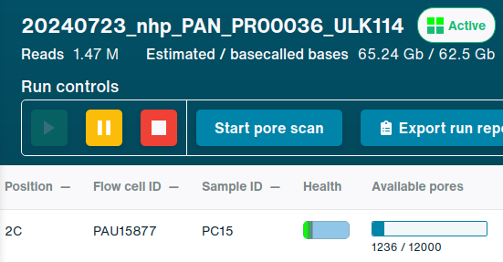
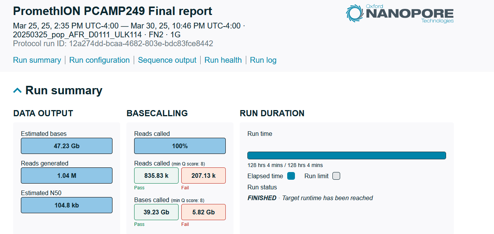
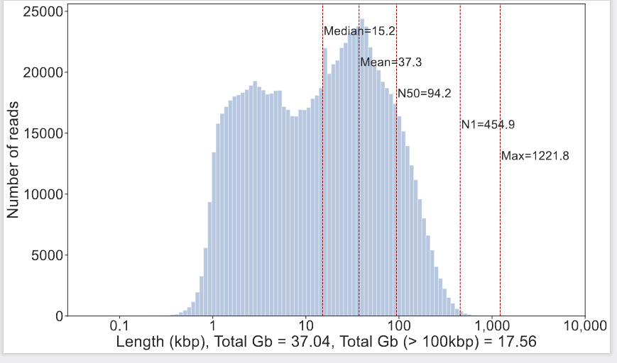

# Structure
`/project/logsdon_shared/long-read-archive` is where sequencing data from the ONT PromethION is stored.

```
/project/logsdon_shared/long-read-archive/
├── clinical
├── nhp
├── pop
├── practice
├── sharing
└── unsorted
```

## Categories
|category|description|
|-|-|
|`clinical`|Human clinical data.|
|`nhp`|Non-human primate data.|
|`pop`|Human population data.|
|`practice`|Practice run data.
|`sharing`|Shared collaborator data.|
|`unsorted`|Unsorted data transferred from the PromethION.|


## Sequencing Run Naming Convention
```
# Sequencing run format
YYYYMMDD_{category}_{sample_abbr_id}_{seq_kit_type}/
```

### Category
See [Categories](#categories).

### Sample Abbreviation and/or ID
Samples should either be a single word
1. Sample ID (ex. `HG00171`)

Or two words delimited by a single `'_'`:
1. Sample abbreviation (ex. `GGO`)
2. Sample ID (ex. `PR00099`)

### Sequencing Kit Type
Any ONT sequencing kit.

## Directory Structure
Each subdirectory will contain sample ID subdirectories derived from the name of the sequencing run.

Three main directories are generated.
* `metadata`
    * A directory with reports for each subsample_id of a run.
* `stats`
    * A directory summarizing all basecalled reads.
* `ubam`
    * A containing unaligned BAM files of basecalled reads.
```
/project/logsdon_shared/long_read_archive/pop/D0111
└── ont
    ├── metadata
    ├── stats
    └── ubam
```

## Variables
|variable|description|
|-|-|
|`category`|Category of sample. See [Categories](#categories).|
|`sample_id`|Sample ID extracted from sequencing run name. See [Sequencing Run Naming Convention](#sequencing-run-naming-convention).|
|`date`|Date of the start of the sequencing run.|
|`subsample_id`|Sample ID given to flowcell in MinKNOW.|
|`basecaller`|Basecaller name.|
|`basecaller_version`|Version of basecaller. Parsed from BAM file header. May be empty.|
|`sample_abbr_id`|Sample abbreviation and ID. If no abbreviation, will be identical to sample_id.|
|`seq_kit_type`|Sequencing kit type.|
|`prep_type`|Library prep type.|
|`subsample_group`|All reads grouped by subsample group prefix.|
|`sample`|All reads grouped by sample.|


> PC15 is the `subsample_id` for 20240723_nhp_PAN_PR00036_ULK114

### `metadata`
Metadata from original MinKNOW run directory for a given run partitioned by subsample_id.

Interactive reports produced by MinKNOW can be found at:
```
/project/logsdon_shared/long_read_archive/{category}/{sample_id}/ont/metadata/{subsample_id}/{flowcell}/report_*.html
```




### `stats`
Read statistics for any given run after `dorado` `SUP` basecalling using our basecalling [pipeline](https://github.com/logsdon-lab/Snakemake-ONT-Basecalling).

Summaries are divided into three categories: `all`, `subsample_id` and `groups` with a shared prefix of subsample_id's.
1. `all`
    * All subsample_ids for a give sample.
2. `group`
    * ex. FN, PC
3. `subsample_id`
    * ex. FN1, FN2, PC1, etc.

Directories will contain read length histograms for the above categories. Follows the following format:

```
{date}_{category}_{sample_id}_{kit}_{count}-{subsample_id}-dorado-{dorado_version}
```



The `group_*_summary.tsv` files will contain read stats like the following:
|Sample|Coverage(X)|Coverage(X,100kb+)|N50(kb)|Reads|
|-|-|-|-|-|
|D0111_all|34.5|18.63|109.51|2380601|

Raw read lengths can be found with files with the format `*_read_lens_filtered.tsv`.

```
040bbf06-f58d-4cbe-b414-db821943dc76    25072   PAY24529_725b4221_06a81932_93.pod5
0cb47f50-e0df-4025-97c3-11bda6799f86    37686   PAY24529_725b4221_06a81932_93.pod5
ced1f37b-637f-4733-8ac6-7c9fcaf308ee    47022   PAY24529_725b4221_06a81932_93.pod5
320bc1f1-c442-4e8c-a003-2f660ce4e10a    45107   PAY24529_725b4221_06a81932_93.pod5
```

### `ubam`
Unaligned BAM files for downstream analysis basecalled with `dorado` and the `SUP` preset.
```
{date}_{category}_{sample_id}_{kit}_{count}-{subsample_id}-dorado-{dorado_version}.bam
```

To view where the files are linked to, use `tree` or `ls -lah`.
```
/project/logsdon_shared/long_read_archive/pop/D0111/ont/ubam/
├── 20250325_pop_AFR_D0111_ULK114_0-FN1-dorado-0.7.3+6e6c45c.bam -> /project/logsdon_shared/long_read_archive/unsorted/20250325_pop_AFR_D0111_ULK114/FN1/20250325_1435_1E_PAY24529_725b4221/pod5/basecalling/20250325_pop_AFR_D0111_ULK          pe" 23:34 02-Oct-25114.bam
├── 20250325_pop_AFR_D0111_ULK114_1-FN2-dorado-0.7.3+6e6c45c.bam -> /project/         tlogsdon_shared/long_read_archive/unsorted/20250325_pop_AFR_D0111_ULK114/FN2/20250325_1435_1G_PBA40097_12a274dd/pod5/basecalling/20250325_pop_AFR_D0111_ULK114.bam                                                                            225
├── 20250401_pop_AFR_D0111_ULK114_0-PC1-dorado-0.7.3+6e6c45c.bam -> /project/logsdon_shared/long_read_archive/unsorted/20250401_pop_AFR_D0111_ULK114/PC1/2  -2250250401_1222_1B_PAY37327_8ffbf438/pod5/basecalling/20250401_pop_AFR_D0111_ULK -114.bam
└── D0111_ubam.fofn
```
