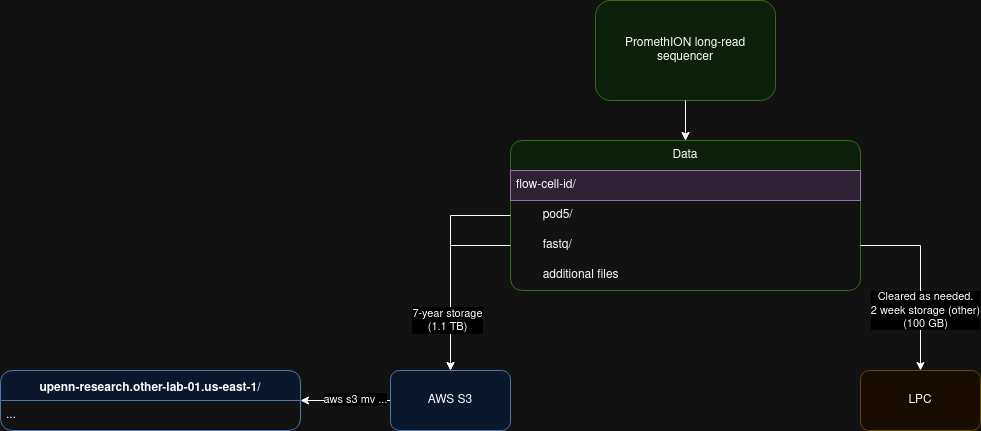

# Workflow (Proposed)
1. The PromethION long-read sequencer generates the data. 
2. This is stored in one directory with the flow cell ID in the name, and it has at least two subdirectories for `fastqs` and `pod5s` (and a few other files).
3. We would upload the parent directory with the flow cell ID, as well as the `pod5` subdir and the `fastq` subdir, and perhaps a third subdir with all other files.
4. Collaborators will need to set up an AWS account and will need to be aware that they will need to pay the cost of restoring/retrieving their data. We would then manually move the flow-cell folder on S3 to the collaborator’s bucket.
5. Additionally, for data generated by our lab, we store the parent directory with the flow cell ID and the fastq subdir on the LPC (we will not need the `pod5` subdir). This we achieved via running rsync via a cron job hourly to our LPC.

